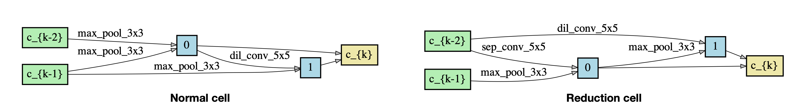
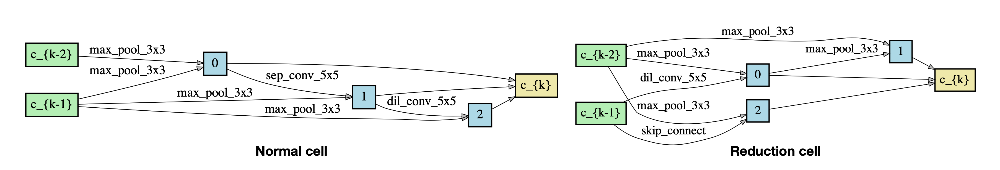
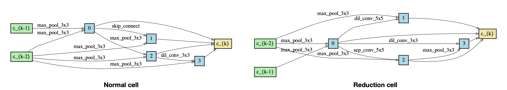
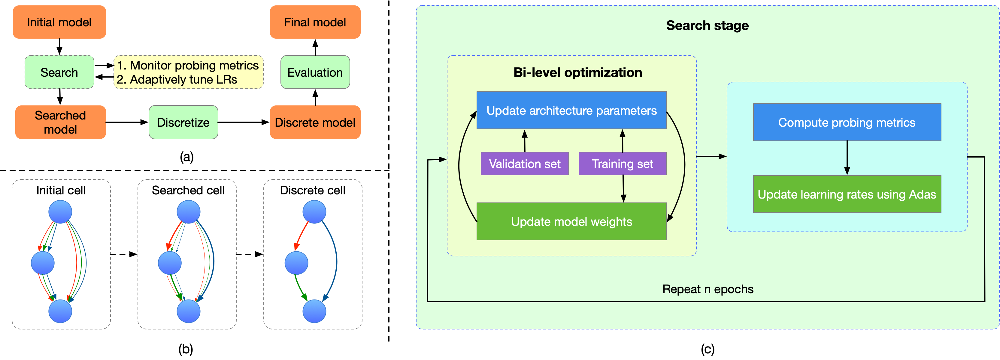
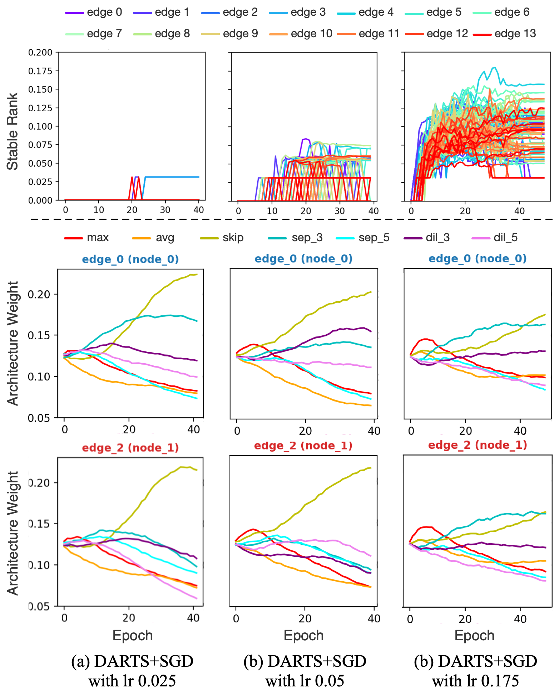
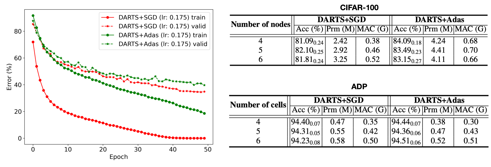
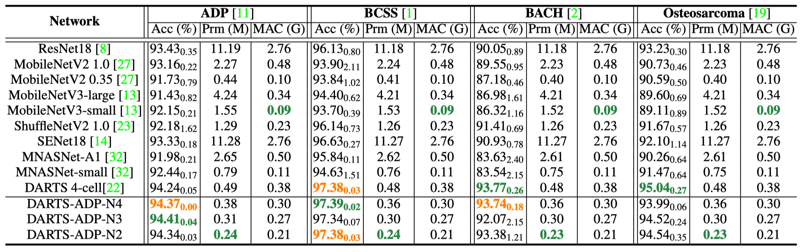

# DARTS-ADP
<!-- - [DARTS-ADP](#darts-adp)
  - [Architectures](#architectures)
    - [Overall architecture](#overall-architecture)
    - [DARTS_ADP_N2](#darts_adp_n2)
    - [DARTS_ADP_N3](#darts_adp_n3)
    - [DARTS_ADP_N4](#darts_adp_n4)
  - [Datasets](#datasets)
    - [ADP](#adp)
    - [BCSS](#bcss)
    - [BACH](#bach)
    - [Osteosarcoma](#osteosarcoma)
  - [Performance](#performance)
  - [Usage](#usage)
    - [Pretrained models](#pretrained-models)
    - [Training](#training) -->

We propose three networks for Computational Pathology (CPath) applications. The network architectures are searched on [ADP](https://www.dsp.utoronto.ca/projects/ADP/) using [Differentiable Architecture Search (DARTS)](https://github.com/quark0/darts) and can be well transfered to other CPath datasets. 

> [**Probeable DARTS with Application to Computational Pathology**](https://arxiv.org/abs/2108.06859),            
> Sheyang Tang, Mahdi S. Hosseini, Lina Chen, Sonal Varma, Corwyn Rowsell, Savvas Damaskinos, Konstantinos N. Plataniotis, Zhou Wang        
> *arXiv technical report ([arXiv: 2108.06859](https://arxiv.org/abs/2108.06859))*
> 
## Architectures
- **Overall architecture**

Above is the overall structure of the searched networks, where the normal and reduction cells are searched. A cell can be represented as a directed acyclic graph with nodes and edges. Each node is a feature map, and each edge belongs to one of the candidate operations, including 3x3 and 5x5 seperable convolutions, 3x3 and 5x5 dilated separable convolutions, 3x3 max pooling, 3x3 average pooling, and skip-connection.

We alter the number of nodes and search for the optimum architectures in each configuration. Here we present three best-performing architectures with different number of nodes.

- **DARTS_ADP_N2:** each cell has 2 nodes.
 

- **DARTS_ADP_N3:** each cell has 3 nodes.


- **DARTS_ADP_N4:** each cell has 4 nodes.


<!-- ## Introduction
We use [Differentiable Architecture Search (DARTS)](https://github.com/quark0/darts) to find the optimal network architectures for Computational Pathology (CPath) applications. This repository provides three architectures that are searched on the ADP dataset, and can be well transfered to other CPath datasets. -->

## Datasets
We search the architectures on the ADP dataset and transfer them to three more datasets including BCSS, BACH, and Osteosarcoma.
- **ADP:** a multi-label histological tissue type dataset. This is where the architectures are searched. More details can be found in the [ADP Website](https://www.dsp.utoronto.ca/projects/ADP/) and [this paper](https://openaccess.thecvf.com/content_CVPR_2019/html/Hosseini_Atlas_of_Digital_Pathology_A_Generalized_Hierarchical_Histological_Tissue_Type-Annotated_CVPR_2019_paper.html).

- **BCSS:** a multi-label breast cancer tissue dataset. More details can be found [here](https://academic.oup.com/bioinformatics/article/35/18/3461/5307750).

- **BACH:** a single-label breast cancer histology image dataset. More details can be found in [this paper](https://www.sciencedirect.com/science/article/abs/pii/S1361841518307941).

- **Osteosarcoma:** contains osteosarcoma histology images and is available through [this website](https://wiki.cancerimagingarchive.net/pages/viewpage.action?pageId=52756935).

## Searching procedure

The searching is based on [DARTS](https://github.com/quark0/darts). We improve the existing DARTS framework with a **probing metric** and an **adaptive optimizer**.

### Probing metric
We apply [stable rank](https://github.com/mahdihosseini/Adas) to monitor the learning process of convolutional layers during searching, and show that the default DARTS lacks proper learning rate tuning.

These are experiments on CIFAR-100. Each column corresponds to a different initial learning rate. 
<p align="center">

</p>

With larger initial learning rate:
- More layers generate higher stable rank, meaning they are learning better.
- The preferance over skip-connection (a common issue when searched on CV datasets) is suppressed, meaning that the resulting network has more learnable parameters and thus performs better.

We show that the default DARTS (left column) lacks proper learning rate tuning. For more details, please refer to the [paper](https://arxiv.org/abs/2108.06859).
### Adaptive optimizer
We change the default SGD optimizer to [Adas](https://github.com/mahdihosseini/Adas), an adaptive optimizer that automatically tunes the learning rates for each layer based on their stable rank evolution. 

Adas helps reduce the gap between training and validation error during searching, leading to more generalizable architectures with higher test accuracy. For more details, please refer to the [paper](https://arxiv.org/abs/2108.06859).


## Performance
The searched networks are trained in 4 datasets and compared with multiple state-of-the-art networks. Results show their superioty in prediction accuracy and computation complexity.


## Usage
### Pretrained models
Pretrained model weights are provided in the `/pretrained` folder, where four subfolders contains pretrained weights for three architectures on each dataset. The script `test.py` demonstrates how to load the pretrained weights of a network and test its performance.

First, download the dataset you want to train on and store them to a local directory.

Then, open `test_demo.sh` and edit the following:
- Change the path of `--data` to where you store the downloaded data.
- Change the name of `--dataset` accordingly. Valid names are `ADP`, `BCSS`, `BACH`, and `OS`.
- Select the architecture you want to train. Valid architectures are `DARTS_ADP_N2`, `DARTS_ADP_N3`, and `DARTS_ADP_N4`.
- Change `--model_path` according to the chosen dataset and architect name. E.g., `./pretrained/ADP/darts_adp_n4.pt` if testing `DARTS_ADP_N4` on `ADP`.

Now, simply run 
```
cd path/to/this-repo
sh test_demo.sh
```

### Training
First, download the dataset you want to train on and store them to a local directory.

Then, open `train_demo.sh` and edit the following:

- Change the path of `--data` to where you store the downloaded data.
- Change the name of `--dataset` correspondingly. Valid names are `ADP`, `BCSS`, `BACH`, and `OS`.
- Select the architecture you want to train. Valid architectures are `DARTS_ADP_N2`, `DARTS_ADP_N3`, and `DARTS_ADP_N4`.
- Other hyperparameters including learning rate, batch size and epochs, etc.

You can open `train.py` to see full details of hyperparameters.

Now, run the demo script to start training
```
cd path/to/this-repo
sh train_demo.sh
```